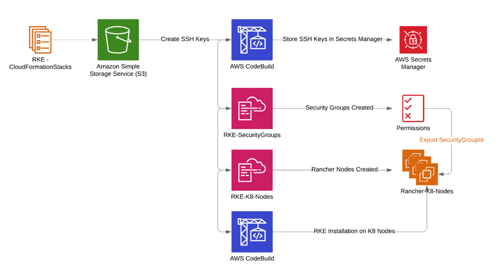
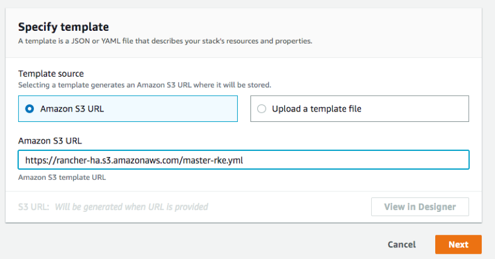
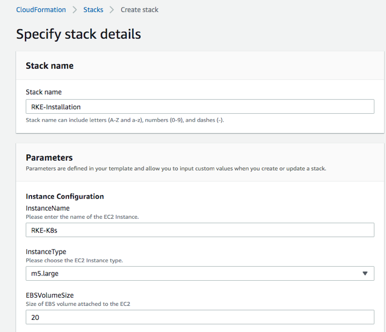
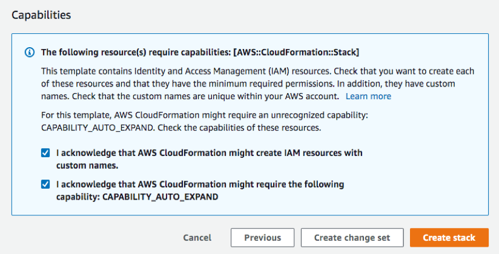
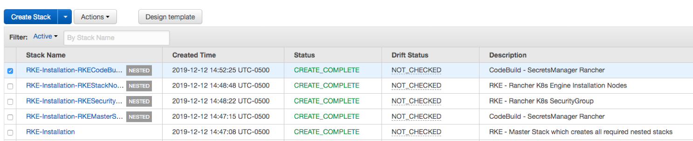
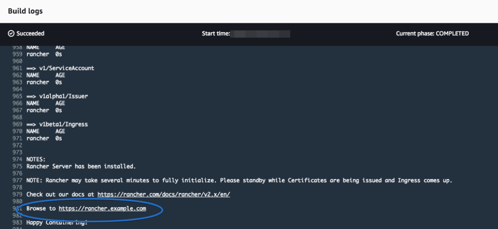
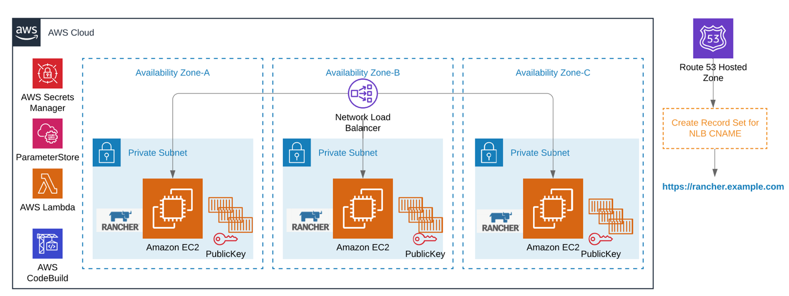

# High Availability Rancher - The Automated Way!

Rancher is an open source application developed for the sole purpose of reducing the complexity of managing multiple Kubernetes (K8s) clusters across various platforms. It enables DevOps engineers a single pane of glass to control K8s clusters wherever they may be, whether it be on-premise or in various cloud providers.

Today, I'm going to show you how to leverage the power of Rancher in a multi account AWS environment to control your K8s clusters both on EKS and EC2 machines. I will show you how to implement Rancher in a highly available way across multiple availability zones to meet your well-architected requirements. We will be deploying Rancher into an AWS account with 3 nodes spanning across several availability zones in our private subnets behind a network load balancer.

Let's get started!

FIXED:

* Created rancherConfigBucket parameter in master-rke.yml for easier customization
* TemplateURL occurrences in master-rke.yml now uses !Join function to leverage the rancherConfigBucket parameter
* Created allowedCidr parameter in rke-securitygroup.yml for easier customization
* cleaned up installer codebuild lambda code

TODO:

- Write up - Two Secrets manager entries must be managed manually (installation will break if they exist)

- Write up - EC2 Key pair that was created during the installation must be managed manually (installation will break if it exists)

- Write up - SSM Param store has two entries 

  - SSH-HostKey-${ApplicationName}
  - ${ApplicationName}

  These must be managed manually (installation will break if they exist)

- Write up - SecretsManager parameter in master-rke.ynl MUST be unique

- Write up and tech - InstanceIamProfile permission requirement

## Initial Setup:

In this post we will be using the [Rancher Kubernetes Engine (RKE)](https:/rancher.com/docs/rke/latest/en/) to simplify the installation complexity of setting up Kubernetes. This of course can be done in various ways, either by using your own laptop and following step by step installation instructions or on an EC2 server itself. However, if you are using a laptop or a server, you need to manually install additional packages like RKE, [Kubectl](https:/kubernetes.io/docs/reference/kubectl/overview/) and [Helm](https:/helm.sh/) in a sequential order. This post leverages AWS native services like [CodeBuild](https://aws.amazon.com/codebuild/), [Lambda](https://aws.amazon.com/lambda/), and [SecretsManager](https://aws.amazon.com/secrets-manager/) to automate the required package installation across multiple EC2 instances so as to achieve maximum consistency, most security and minimal effort.

## Breakdown of the AWS services involved

The diagram shown here illustrates the installation flow and mandatory configuration steps. One key example of mandatory configuration steps is the generation of a SSH key pair for the K8 nodes so as to allow the RKE to securely communicate and install the necessary configuration packages. In order to establish the secure channel, a private and public key pair needs to be created. While there are many ways to manage SSH key pairs, the main goal here is to automate every aspect of the build in order to have a highly available and consistent deployment of Rancher in your AWS account.

## Deploying the Solution

1) Create your S3 bucket: Note: Bucket names must be globally unique across all AWS accounts globally.

    Example:
    `aws s3 mb s3://rancher-ha –region us-east-1`

2) Download the cfn (CloudFormation) templates:
    
    | Files To Download                                                                                                      |
    | -------------                                                                                                          |
    | [master-rke.yml](https://github.com/kandruch/Rancher-HighAvailability/blob/master/master-rke.yml)                      |
    | [codebuild-secretsmanager.yml](https://github.com/kandruch/Rancher-HighAvailability/blob/master/secretsmanager.yml)    |
    | [rke-securitygroup.yml](https://github.com/kandruch/Rancher-HighAvailability/blob/master/rke-securitygroup.yml)        |
    | [rke-nodes.yml](https://github.com/kandruch/Rancher-HighAvailability/blob/master/rke-nodes.yml)                        |
    | [codebuild-installer.yml](https://github.com/kandruch/Rancher-HighAvailability/blob/master/codebuild-installer.yml)    |

3) In the file rke-securitygroup.yml, adjust the value for the parameter allowedCidr.  The default is 10.0.0.0/16.

4) Upload your CloudFormation files to the s3 bucket (the command below will upload all files located in a directory):

    Example:
    `aws s3 cp <your directory path> s3://rancher-ha --recursive --region us-east-1`

5) Create an IAM role for EC2 if one does not currently exist https://docs.aws.amazon.com/AWSEC2/latest/UserGuide/iam-roles-for-amazon-ec2.html#ec2-instance-profile. In my case I created one called “EC2-Services” and attached a permissive policy AdministratorAccess for demonstration purposes.

6) Go to the AWS CloudFormation console and choose the Create new stack button.

7) At the ‘Specify an Amazon S3 template URL’ provide the link to the CloudFormation script (in my case https://rancher-ha.s3.amazonaws.com/master-rke.yml). Choose Next.

8) Enter the required values for the CloudFormation Stack name and parameters (keep the default parameters if it suits your needs). I called it “RKE-Installation” and gave my instance names, type, volume size, KeyPair Name, etc… 

Note: this installation assumes you have a VPC created with at least 2 or more private subnets spread across multiple availability zones. If not please create a VPC and subnets before deploying this solution. https://docs.aws.amazon.com/directoryservice/latest/admin-guide/gsg_create_vpc.html

9) Acknowledge that the template contains IAM resources and then Create stack.

   The build takes about 5-10 minutes to complete. You should see a CREATE_IN_PROGRESS status and shortly after, you will see a CREATE_COMPLETE status.

   Once the build is complete check CodeBuild and look at the build logs, you will see the installation as complete as shown below:

At this point, the CloudFormation scripts have built the entire solution. You now have a deployment of Rancher running      across three EC2 instances in different availability zones behind a network load balancer with a private hosted Route53 zone and a CNAME record set for your chosen domain.

