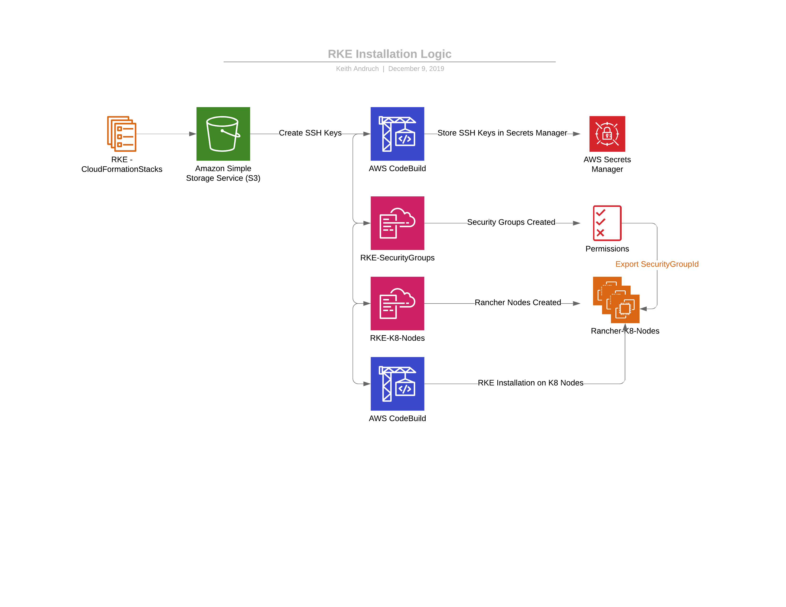

# RANCHER High Availability - In A Multi Account Environment with RKE

Rancher is an open source application developed for the sole purpose of reducing the complexity of managing multiple kubernetes clusters across various platforms. It enables DevOps engineers a single pane of glass to control kubernetes clusters wherever they may be, whether it be on-premise or in various cloud providers.

Today, I'm going to show you how to leverage the power of Rancher in a multi account AWS environment to control your kubernetes clusters both on EKS and EC2 machines. I will show you how to implement Rancher in a highly available way across multiple availbility zones to meet your well-architected requirements. We will be deploying Rancher into our CI/CD account with 3 nodes spanning across 3 availability zones in our private subnets behind a network load balancer.

Let's get started!

# Prerequisites:

This guide assumes you have multiple AWS accounts. For most enterprise customers you would normally have a dedicated shared services account or CI/CD account to host your management tools. Please refer to the AWS landing zone overview for more details https://aws.amazon.com/solutions/aws-landing-zone/.

1) A laptop or EC2 machine with internet access on ports 22 and 443

2) Optional: An EC2 jumphost if deploying the Network Load Balancer in the private subnets.
- Since the Kubernetes cluster will be implemented in the private subnets behind an internal network load balancer you will not have direct communication access. However if your building this inside your corporate network and you have SSH access to your AWS accounts then you can skip this step.

# Breakdown of the AWS services involved.

